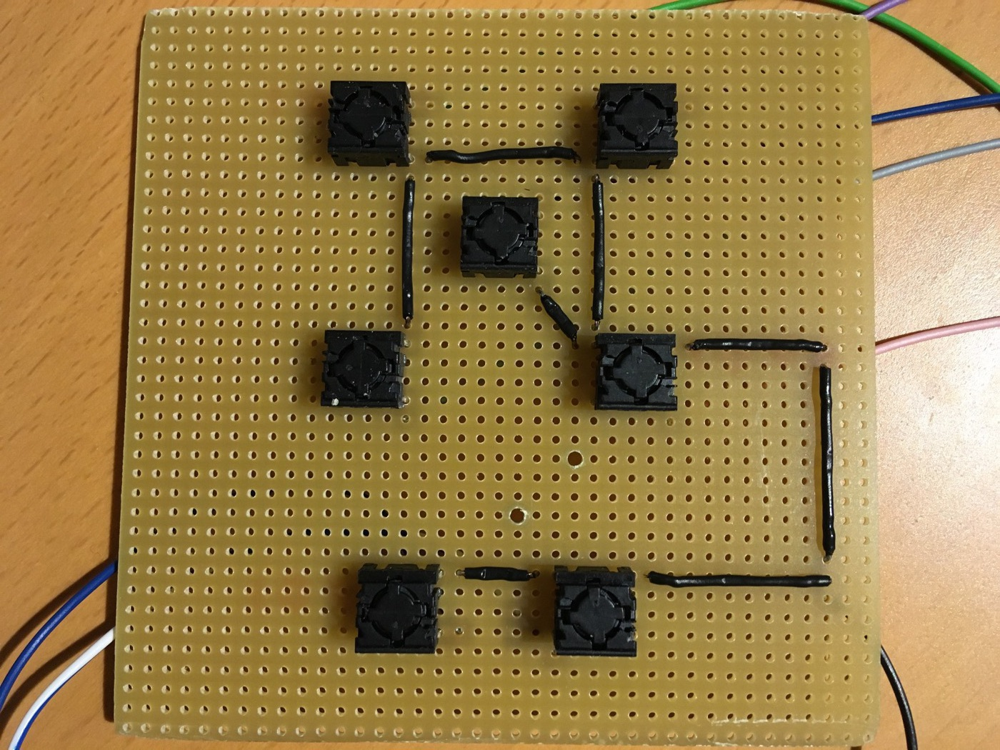
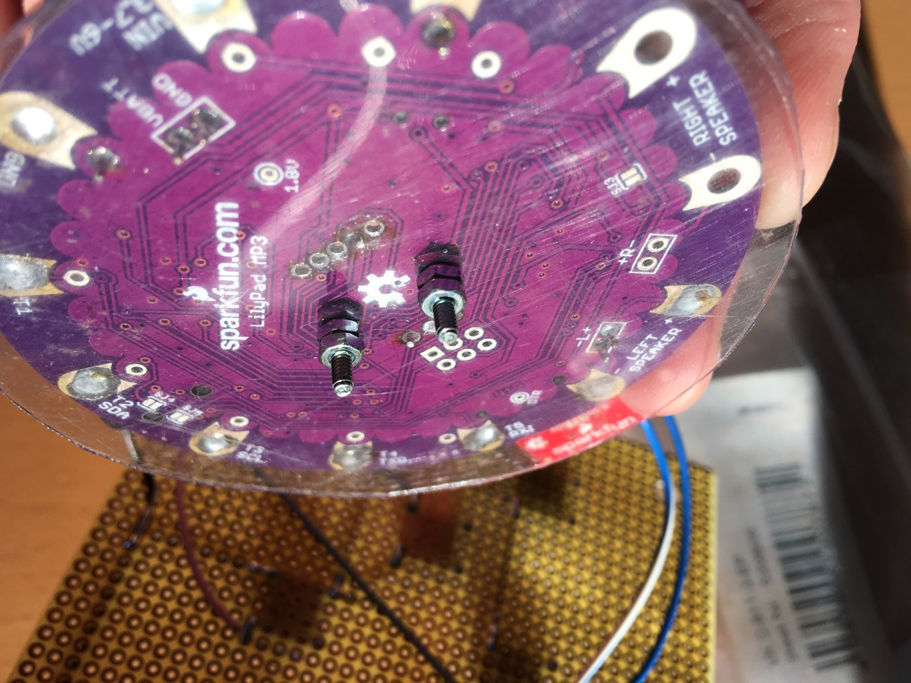

Assembly
========

Here are some photos and notes from the assembly.

Board and wiring
----------------

1. Soldering the micro switches to the matrix board as well as the ground wires.
  
2. Connecting the switches to the corresponding pins on the Lilypad (here: ground as well as fast-forward/backwards switches).
  
3. Connecting the 5 playlist switches to the corresponding trigger pins on the Lilypad.
  
4. Making sure the bottom of the Lilypad is protected when placing it above the matrix board.
   
   
5. Connecting potentiometer, battery and speaker and running some tests.
   

Casing
------

1. Bezel for the speaker grid.
   
   
2. Front plate with holes for buttons and speaker. It was a bit tricky to get the holes right so that the keycaps fit neatly without getting caught. File to the rescue.
   
   
3. Frame parts and handle. It's hardwood (beech), so it is recommended to pre-drill holes for battery holders and handle.
   
4. Holes for power switch and potentiometer. On the inner side, the holes were broadened with a hole saw because switch and potentiometer need a lot of space.
   
   
5. Putting all parts together using wood glue.
   
   

Final assembly
--------------

1. Mounting power switch and battery holders. Power wiring. Using spacers to make sure the keycaps have the right height on the outer side.
   
   
   
2. Inserting and fasting potentiomer, board and speaker.
   
   
3. Again, power switch and volume potentiometer from both sides. The shaft of the potentiometer needs to be shortened so that the knob fits correctly.
   
   
4. Completed.
   