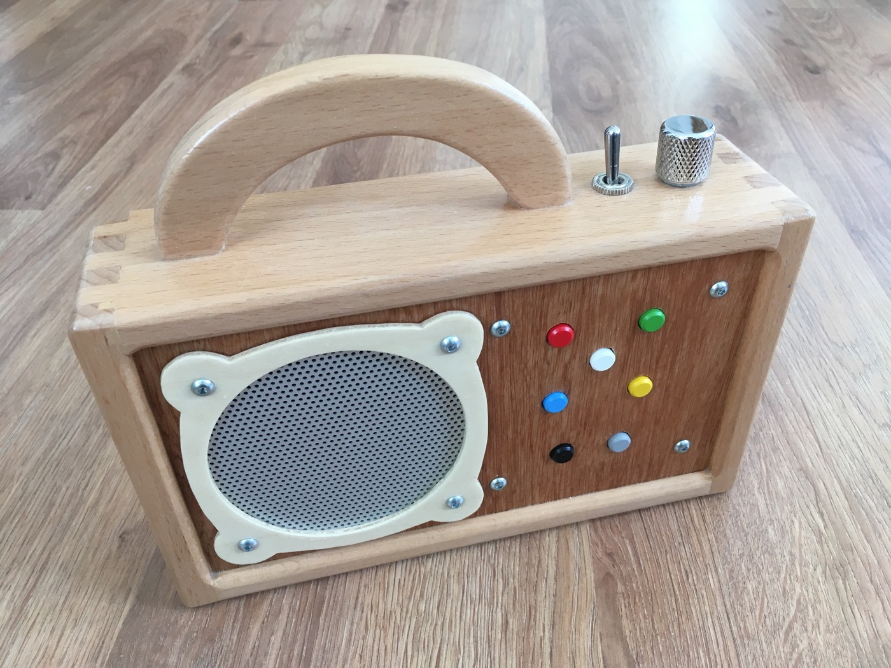

Hörbert Clone
=============

An audio player for kids inspired by the original *Hörbert* (https://hoerbert.com).

Features
--------

- battery powered (4x 1.5V AA), lasts 10-20 hours (depending on the volume)
- 5 playlists, each up to 30 tracks
- micro-SD card
- supported audio formats: MP3, OGG, AAC, WMA, WAV, MIDI
- costs: 70+$ (depending on your casing)

Electronics
-----------

### Board

The core of the player is the [Sparkfun LilyPad MP3](https://www.sparkfun.com/products/11013), an Arduino-compatible board including audio decoder chip (for MP3 and other formats), micro-SD card socket and stereo audio amplifier. So it's pretty much all we need.

The advantage of the LilyPad and the key reason why I ended up using this board is the fact that it can be powered by just 3.5-6V. It also has a separate battery connector for 3.7V Lipo batteries. I decided to go with 4 regular 1.5V AA batteries (preferably rechargeable), since those are available pretty much everywhere (useful when e.g. on vacation abroad).

The board has 5 trigger pins, which are used for the 5 different playlists. It also has connections for a rotary encoder in the center of the board, which is the suggested user interface for this board. However, I used the headers for volume control, fast forward and previous track functions instead.

The board has connectors for two speakers (stereo) as well as a 3.5mm stereo headphone jack. In this case, only one speaker is used.

More information on the board and how to use it can be found on the Sparkfun website: [Getting Started with the LilyPad MP3 Player](https://learn.sparkfun.com/tutorials/getting-started-with-the-lilypad-mp3-player)

### Controls

I pretty much followed the original Hörbert. 

As for the buttons I used simple micro switches (e.g. [Multimec 5G](https://www.reichelt.de/taster-5g-multimec-tht-no-mec5g-thtno-p178336.html) with keycaps in lots of different colours). They look nice, are easy to push and have a great audible and tactile feedback.  

A heavy metal flip switch is used as power switch. It's really snappy and makes a great clicking sound.

For the volume control I used a 5k linear potentiometer (e.g. [this one from Conrad](https://www.conrad.de/de/potentiometer-service-2164-dreh-potentiometer-mono-02-w-5-k-1-st-450015.html)) and a guitar knob (e.g. [this one from Thomann](https://www.thomann.de/gb/harley_benton_parts_t_style_dome_knob_ch.htm)).

All the controls are very haptic and provide good feedback, making them very intuitive even for toddlers.

The buttons work the following:

- There is no play or pause button. The next track is played automatically. Playlists auto-repeat (i.e. after reaching the end of a playlist it starts again with the first track).
- Pushing a coloured playlist button switches to the underlying playlist (just folders `01` to `05` on the SD card) and starts playing this playlist from the beginning.
- Pushing the button of the current playlist plays the next track on that playlist (based on alphanumerical filename sorting). From the last track on the playlist it jumps to the first track again.
- The grey button is fast-forward.
- Pushing the black button plays the previous track on the current playlist. From the first track on the playlist it jumps to the last track.

### Speaker and other stuff

Following the original, I used the **Visaton FR 10 HM**. It has good sound quality (at least to my ears) and together with the Lilypad board it's sufficiently loud. You don't want your kid's audio player to be too loud anyway, right? ;)

And then you need a battery holder (depending on the space in your casing, I used 2 holders for 2 batteries each), a matrix board, some screws/nuts, some spacers and some cables (the wires of a dispensable Ethernet cable will do).

Casing
------

Again I decided to stick to the original, also because I like Hörbert's wooden design a lot. Obviously, you can use your imagination here. You can also find some inspiration at [heise](https://www.heise.de/ct/artikel/Hoerbert-im-Eigenbau-2497099.html) or on the [Hörbert webpage](https://www.hoerbert.com/kreationen/).

Assembly
--------

Some short assembly instructions and photos can be found [here](Assembly.md). 

Sketch
------

I started with the Lilypad player example sketch which can be [downloaded from the Sparkfun website](https://github.com/sparkfun/LilyPad_MP3_Player/archive/master.zip) and adapted it more and more to my needs.

The sketch should be fairly well commented. Some things to mention, though:

### Playlist and filesystem limitations

Due to the fact that the FAT filesystem has no concept of sorting of files, the `openNext()` method of the SdFat library does not necessarily return the next file in the sense of alphanumerical sorting. However, this is expected when filling the SD card with audio files. The file names shall determine the order in which the files are played.

So on every playlist change (i.e. directory change), the directory is indexed, i.e. the filenames are read, sorted and stored in a list. When jumping to the next track, the filename is taken from the in-memory list and used to call the `playMP3(filename)` function of the SFEMP3Shield library.

Obviously this strategy is costly in terms of memory and we only have 2kB of RAM. That's why the following limitations have been set up:

- 8.3 style filenames only (make sure that in *SdFatConfig.h* the parameter `USE_LONG_FILE_NAMES` is set to `0`)
- 30 files per playlist at most

It might be worth storing the list of filenames in the EEPROM instead. However, I think 30 files per playlist is enough and more might overwhelm a kid.

### Volume control

Volume on the audio chip is controlled in 256 discrete steps (0 to 255, where 0 is the loudest). Depending on the speaker and your preference, it might be necessary to set a certain minimum volume (90 in my case).

Since we use a potentiometer on an analog port, we measure values between 0 and 1023. These values from the analog port will then be mapped to the allowed volume range (considering the minimum volume).

### Automatic gain control

The amp chip has a feature called 'automatic gain control'. From the datasheet:

> The Automatic Gain Control (AGC) feature provides continuous automatic gain adjustment to the amplifier through an internal PGA. This feature enhances the perceived audio loudness and at the same time prevents speaker damage from occurring (Limiter function).

As a side effect the amp will slowly increase volume on startup of the MP3 player and if volume has been increased rapidly. This might confuse or annoy the user (especially children). That's why this behaviour is switched off at startup using the TPA2016D2 library provided by Sparkfun.

Lessons learned / Conclusion
----------------------------

- It's a lot of fun to design and implement the player on your own (or with the help of friends and family).
- You get an idea of what product design is about.
- The Lilypad MP3 is ideal for building a portable audio player and the Sparkfun documentation is great.
- Considering all the time and material that was spent on that project, the original Hörbert does not seem overpriced anymore.

If you don't insist on tinkering around and you can afford to **buy the original Hörbert**, do it. It's a great and valuable device and definitely worth its money. They also offer just the electronics as a DIY kit (if you want to build your own casing anyway).